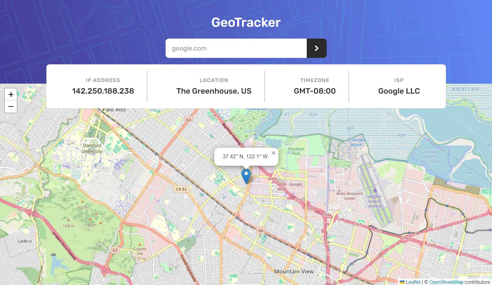

# GeoTracker: Locate Your IP and Domain

GeoTracker is a powerful React-based application that allows users to track IP addresses and domains, visualize their geolocation on an interactive map, and view detailed information like timezone, ISP, and more. The app includes built-in rate limiting to ensure stable and sustainable service for all users.

---

## 🚀 Live Demo

[GeoTracker Live](https://geo-tracker-kappa.vercel.app/)

## 📸 Screenshot



## 📚 Overview

GeoTracker helps you:

- Find the geolocation of any IP address or domain.
- Visualize the location on an interactive map.
- Get details like city, country, timezone, and ISP.
- Manage API usage with smart daily rate limiting.

Built using modern web technologies to ensure performance and reliability.

## 🛠️ Tech Stack

- **Frontend**: React, React Leaflet, Leaflet.js
- **API**: [IP Geolocation API by ipify](https://geo.ipify.org)
- **Build Tool**: Vite
- **Styling**: CSS

---

## 💻 How to Use the App

1. **Visit the live demo or clone the repository:**
   ```bash
   git clone https://github.com/KeepSerene/ip-address-tracker-fem.git
   cd ip-address-tracker
   ```
2. **Install dependencies:**

   ```bash
   npm install
   ```

3. Set up environment variables:

- Create a .env file in the root directory.
- Add your IP Geolocation API key:

```makefile
VITE_API_KEY=your_api_key_here
```

4. Run the development server:

```bash
npm run dev
```

5. Build for production:

```bash
npm run build
```

---

## 👨‍💻 Author

_Dhrubajyoti Bhattacharjee_

- GitHub: [KeepSerene](https://github.com/KeepSerene)
- LinkedIn: [Dhrubajyoti Bhattacharjee](https://www.linkedin.com/in/dhrubajyoti-bhattacharjee-320822318/)

## ✨ Features

- Automatically fetches your IP address and location on page load.
- Search for any IP address or domain.
- Interactive map with markers for precise geolocation.
- Displays key information like city, country, timezone, and ISP.
- Smart rate limiting system:
  - 15 requests per day limit to ensure API sustainability
  - Automatic counter reset at midnight
  - Visual indicator when approaching the daily limit
  - Clear feedback when limit is reached

## 🌟 Future Updates

- Add support for IPv6 addresses.
- Include more detailed information from the API.
- Implement dark mode.
- Add a history feature to track past searches.

## 🛠️ Contribution

Contributions are welcome! Feel free to submit issues or pull requests to enhance the app.

## 📜 License

This project is licensed under the MIT License.
